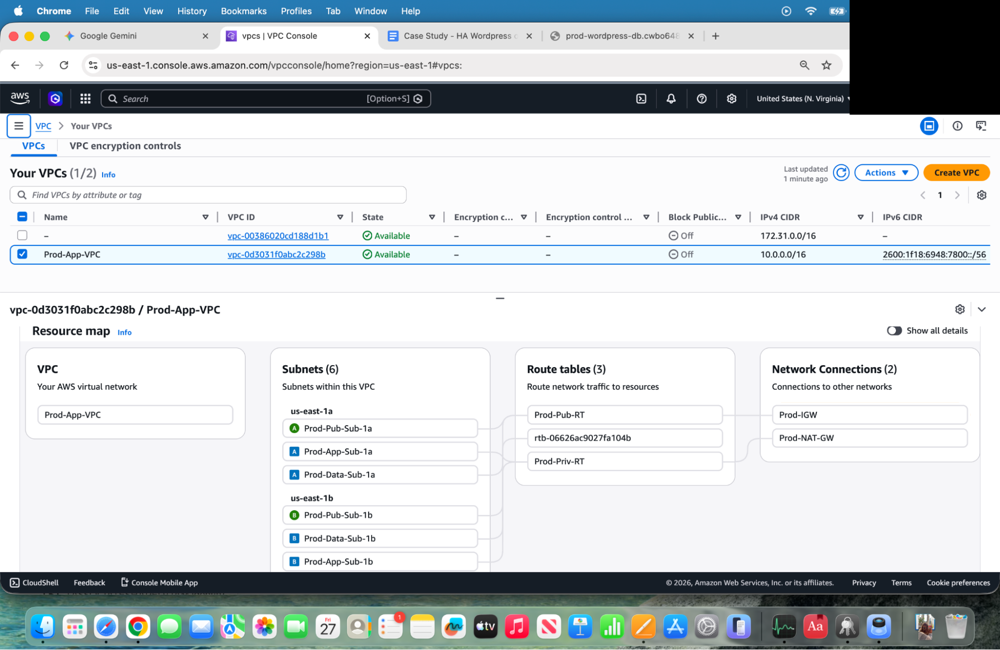
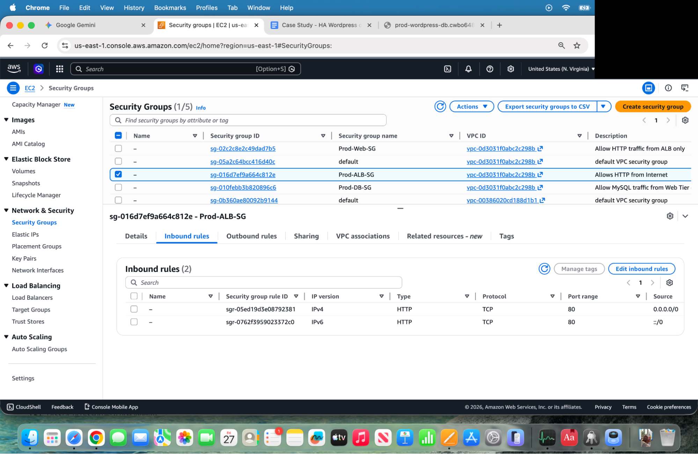
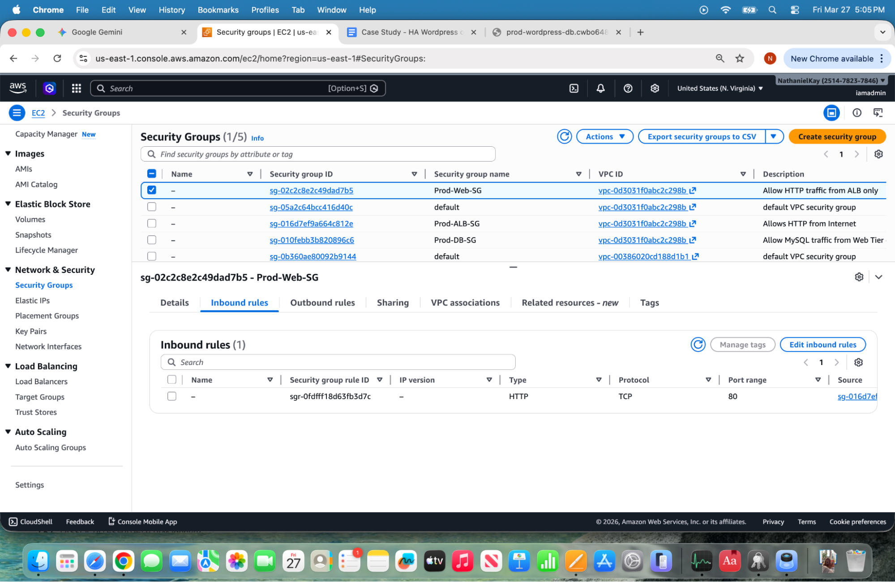
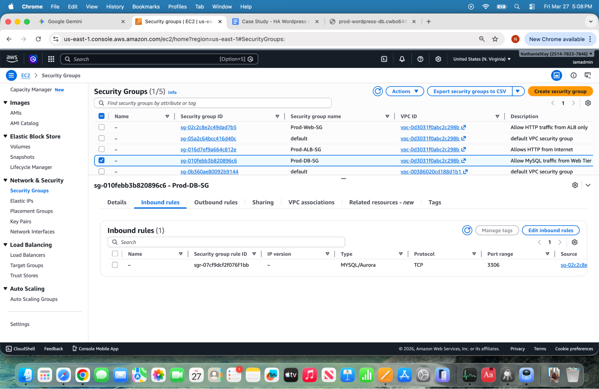
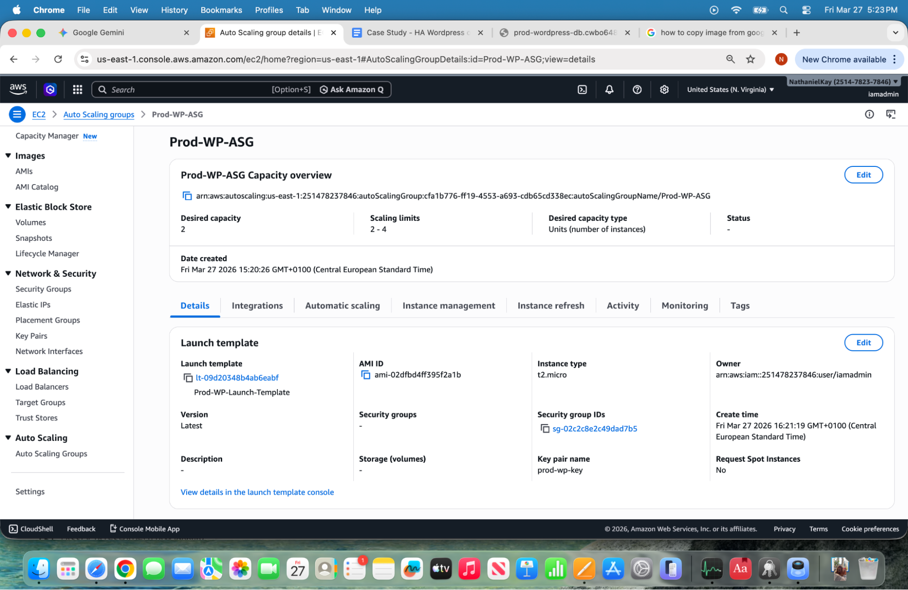
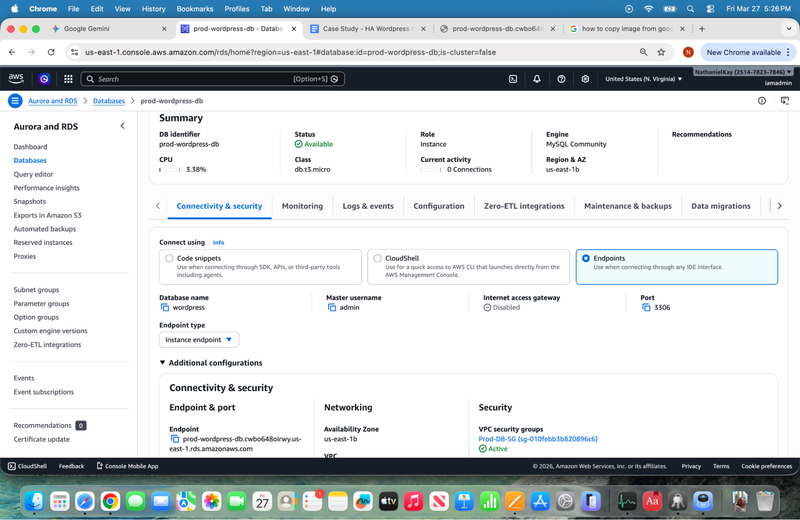
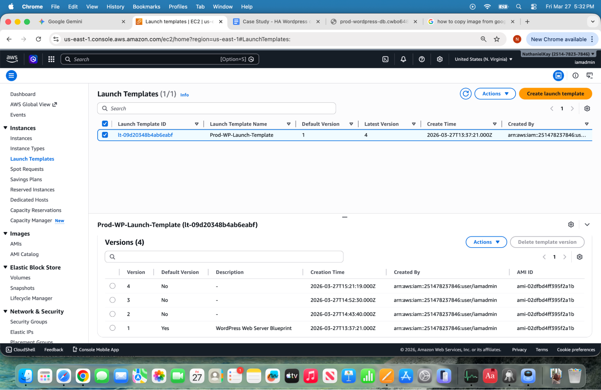
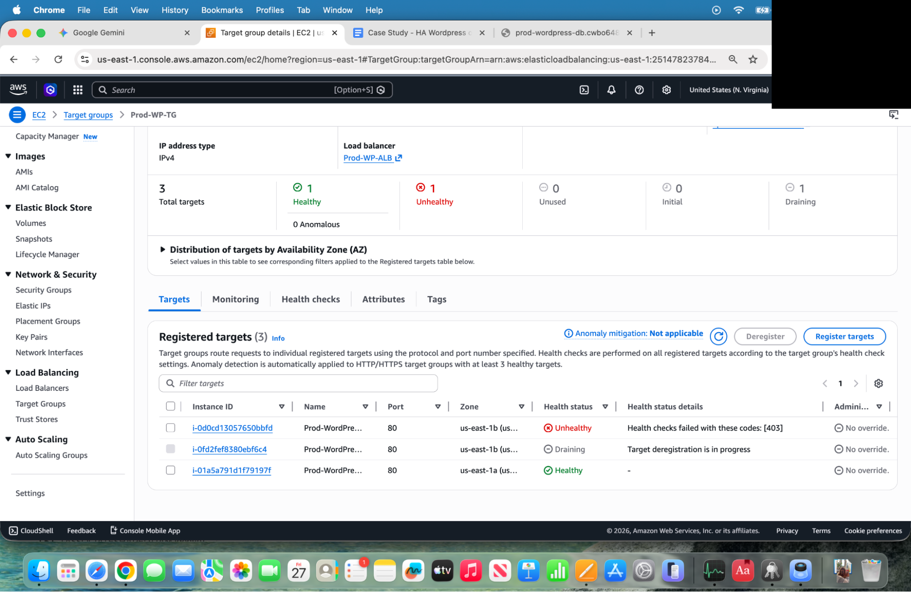

# High-Availability 3-Tier WordPress Stack on AWS

This project demonstrates a complete, 3-stage evolution of architecting, manually provisioning, and eventually automating a secure, highly available, three-tier WordPress environment on AWS.

## 🗺️ Project Navigation: The 3 Iterations

To maintain maximum transparency, cost control, and a deep technical understanding, this project was developed across three distinct phases:

### 📍 Iteration 1: The Manual Console Build (Foundational Knowledge)
* **What it is:** Scroll down to read the **Manual Deployment Case Study**. I built this entire VPC, the decoupled DB tiers, and load balancing natively in the AWS Console. 
* **The Goal:** To gain a deep operational understanding of secure networking, high-availability compute, and decoupled data layers before touching automation.

### 📍 Iteration 2: Manual HCL & Basic Translation
* **What it is:** Click into the [terraform-automation/](./terraform-automation) folder to see the complete set of dry, reusable Terraform blueprints that script this exact same environment.
* **The Goal:** I manually translated my physical build into Infrastructure as Code (IaC) files to understand the modern DevOps lifecycle and establish local state environments.

### 📍 Iteration 3: Advanced AI Prompt Engineering (The "One-Shot" Goal)
* **What it is:** Read the section directly below regarding my use of multi-constraint AI prompting. 
* **The Goal:** I used a large language model as a collaborative sounding board to stress-test prompt structures. The end goal was to reverse-engineer a single, highly constrained prompt capable of reproducing this entire repository flawlessly in one go.

---
## 📍 Iteration 1: Manual Deployment Case Study

<b>Click to expand full operational breakdown of the Manual AWS Build</b>

### Project Overview

The goal of this project was to architect and manually deploy a highly available, three-tier WordPress environment on AWS. By building this from scratch in the AWS Console, I gained a deep operational understanding of secure networking, high-availability compute, and decoupled data layers. This project demonstrates a security-first approach, utilizing private subnets, NAT Gateways for secure egress, and automated recovery via Auto Scaling and Launch Template versioning.

### Figure 0: High-Level Solution Architecture

*This diagram represents the logical design of the Three-Tier WordPress Stack I manually provisioned in the AWS Console. It reflects the VPC configuration, the Auto Scaling Group (Prod-WP-ASG), the managed RDS instance, and the tiered Security Group strategy used to ensure 'Least Privilege' access across the entire stack.*

---

## 2. Networking & Infrastructure (The Foundation)
I manually configured the following core AWS components to ensure a secure and redundant environment:

* **Virtual Private Cloud (VPC):** I created a custom network to isolate the application's resources.
* **Subnets:** I designed a multi-Availability Zone (AZ) layout to ensure that if one data center fails, the website stays online.
* **Internet Gateway (IGW):** I attached an IGW to the VPC to serve as the "Front Door" for the Application Load Balancer. 
* **NAT Gateway:** To maintain a high security posture, I placed a NAT Gateway in the public subnet. This allowed the WordPress servers—located in Private Subnets—to securely reach out to the internet for updates without being exposed to incoming threats.

### Figure 1: Custom Multi-AZ VPC Architecture

*This Resource Map visualizes the foundational network built from scratch, featuring a three-tier subnet strategy mirrored across two Availability Zones.*

### Figure 2: Public-Facing Load Balancer Security Group

*I manually configured these rules to allow standard web traffic (HTTP Port 80) from any location on the internet.*

### Figure 3: Restricted Web Tier Security Group

*The 'Internal Door' security: I configured the Prod-Web-SG to only accept traffic if it comes directly from the Load Balancer's Security Group ID.*

### Figure 4: Isolated Database Security Group

*This final layer protects the application's data. I configured the Prod-DB-SG to only accept traffic on Port 3306 (MySQL) if it originates from the Prod-Web-SG.*

---

## 3. The Technical Stack
* **Traffic Management:** I set up an Application Load Balancer (ALB) to act as the single entry point for all web traffic.
* **Automated Compute:** I configured an Auto Scaling Group (ASG) to manage a fleet of EC2 instances that can grow or shrink based on demand.
* **Managed Database:** I deployed an Amazon RDS (MariaDB) instance to keep the website’s data separate from the web servers.

### Figure 5: Auto Scaling & High Availability Configuration

*This shows the configuration of the Prod-WP-ASG with a Desired Capacity of 2 instances across multiple Availability Zones.*

### Figure 6: Decoupled Data Tier (Amazon RDS)

*By utilizing a managed database service, the data tier is "decoupled" from the web servers, ensuring data remains persistent even if instances are refreshed.*

---

## 4. The Problem: "Server Busy" & File Permissions
After the initial manual setup, I encountered an error where WordPress could not upload media or site icons, reporting a "Server Busy" status.

* **The Issue:** The Linux web server (Apache) did not have the correct permissions to write files to the application folders.
* **The Cloud Fix:** I updated the **Launch Template** with a permission-fixing script to ensure every future server would be provisioned with the correct settings.
* **The Deployment:** I triggered an **AWS Instance Refresh** to swap out old servers for the new, fixed versions without taking the website offline.

### Figure 7: Infrastructure-as-Code Versioning

*By iterating from the initial configuration to Version 4, I was able to troubleshoot and finalize the system’s requirements.*

### Figure 8: High-Availability Target Group During Rolling Deployment

*This screenshot captures the ALB mid-deployment. The image shows the 'Rolling Update' strategy in action: the ALB is health-checking the new instance while gracefully 'Draining' traffic from legacy instances.*

---

## 5. Key Learnings
* **Network Architecture:** Learned how to manually route traffic through VPCs, Subnets, and Internet Gateways.
* **Security Best Practices:** Gained experience in "Least Privilege" security by configuring Security Groups to protect the database from direct internet access.
* **Scaling Logic:** Realized that in a professional cloud setup, you fix the template, not the individual server.

### AWS Services Manually Configured
* **VPC & Subnets:** Network isolation and Multi-AZ redundancy.
* **Internet & NAT Gateways:** Public ingress and secure private egress.
* **Security Groups:** State-aware firewalls for the Web and Database layers.
* **EC2 & Auto Scaling:** Managed server lifecycle and fleet health.
* **Application Load Balancer:** External traffic routing and Target Group management.
* **RDS (MariaDB):** Dedicated, decoupled database management.

---

## Cost Analysis & Free-Tier Optimization

To validate the architecture while avoiding unnecessary AWS billing overhead during the development and testing phase, the infrastructure was strictly sized within the **AWS Free Tier** limits. 

### **The Provisioned Baseline (Estimated ~$35/month if outside Free Tier)**
* **Compute:** 2x **t2.micro** (or **t3.micro**) instances (1 vCPU, 1GB RAM) to run the Apache/WordPress web tier.
* **Database:** 1x **db.t2.micro** (or **db.t3.micro**) RDS MySQL instance.
* **Storage (EBS):** Standard 20GB **gp3 EBS volumes** attached to each instance for the OS and local website files.
* **The "Hidden" Heavy:** 1x **NAT Gateway** (~$33/month baseline + $0.045 per GB). *Note: While the compute and database fell under the Free Tier, the NAT Gateway is a paid resource. In a strict zero-cost lab, this can be swapped for a NAT Instance or removed.*

### **The Serverless Pivot Threshold**
While this traditional EC2 + ALB + ASG setup is excellent for learning core infrastructure, it carries a fixed baseline cost (mainly driven by the NAT Gateway and baseline compute if Free Tier expires).

**When to pivot to Serverless (AWS ECS Fargate & Aurora Serverless):**
1. **Low or Spiky Traffic:** If the application has highly intermittent traffic (e.g., an internal tool used only a few times a week), paying for idle EC2 and RDS instances is highly inefficient.
2. **The Break-Even:** Shifting to **AWS Fargate** (paying strictly per vCPU/second) and **Aurora Serverless v2** removes the idle compute tax, dropping the baseline cost to near-zero when inactive.

---

## Architectural Trade-offs

Engineering is the art of making calculated trade-offs. To deliver this project on a minimal budget while proving high-availability concepts, the following decisions were made:

* **Micro-Instances vs. Performance:**
  * *The Decision:* Used `t2.micro`/`t3.micro` instances.
  * *The Trade-off:* With only 1GB of RAM, these instances can easily bottleneck under high concurrent PHP/WordPress traffic. For a live production workload, trading cost for at least `t3.small` or `t3.medium` instances would be required to prevent memory exhaustion.
* **Local EBS vs. Shared File Systems (EFS):**
  * *The Decision:* Used standard EBS volumes for storage on each instance.
  * *The Trade-off:* This is the most cost-effective storage option, but it means media files uploaded to one WordPress instance won't automatically sync to the other instance in the Auto Scaling Group. To make this production-ready, we would trade the cost savings of EBS for a shared **Amazon EFS** mount or offload media files to **Amazon S3**.

## 🛠️ Core Skills & Tooling Utilized

To execute this project across all three iterations, I had to learn and implement a modern DevOps tech stack from scratch. 

| Category | Tools & Concepts Learned |
| :--- | :--- |
| **Cloud Infrastructure** | AWS (VPC, EC2, RDS, ALB, ASG, IAM, Route Tables, IGW, NAT Gateways) |
| **Infrastructure as Code** | Terraform (HCL), State Management, Variables, Data Sources, Lifecycle Rules |
| **Dev Environment** | VS Code, Git, GitHub, CLI execution, YAML/Markdown documentation |
| **Linux Administration** | SSH, Apache (httpd) setup, package management (yum), file permissions (`chmod`/`chown`) |
| **Modern AI Workflows** | Prompt Engineering, Role-Based constraints, AI output auditing and debugging |
