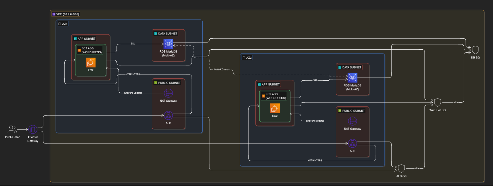
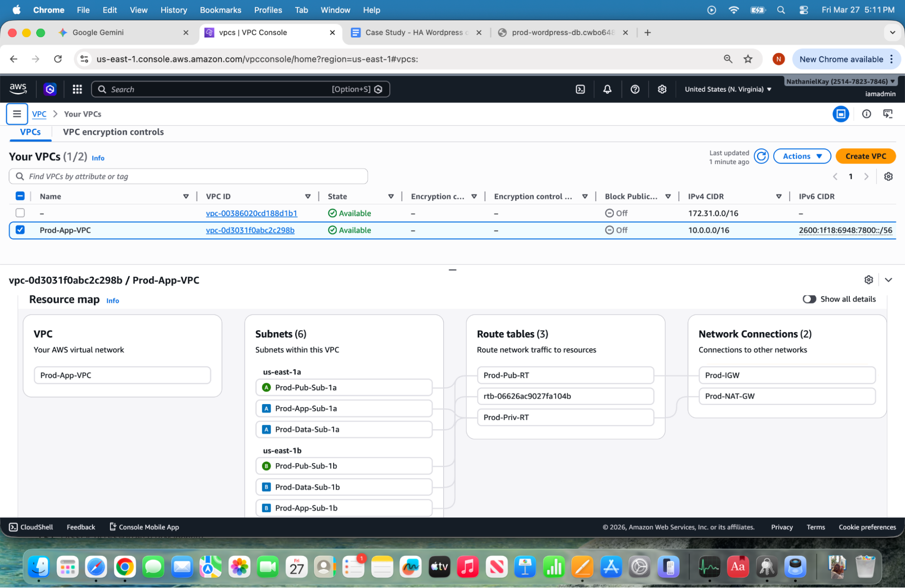
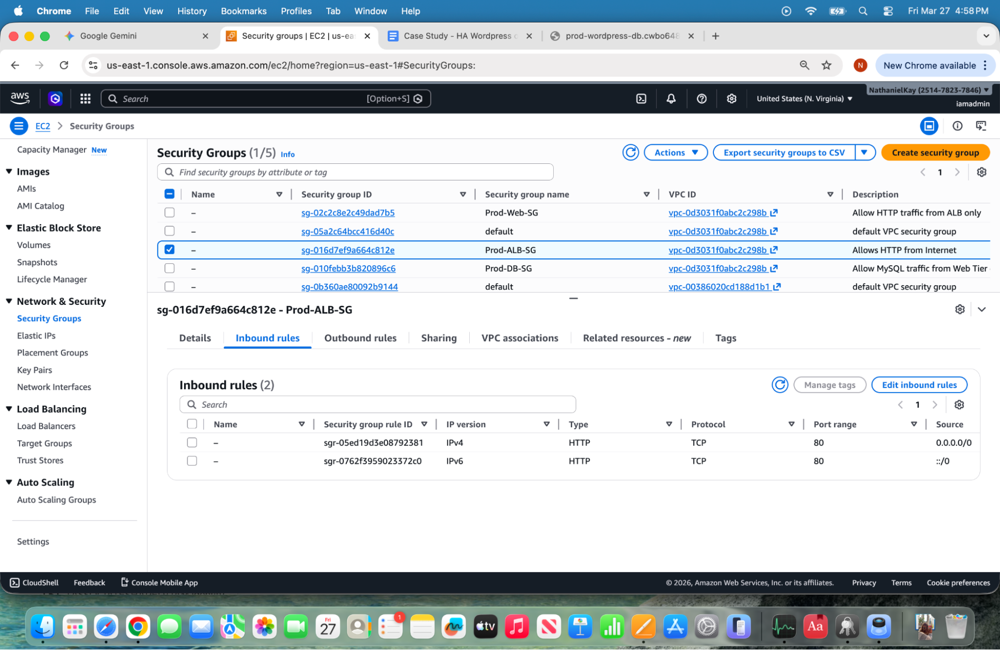

# Case Study: Building a High-Availability WordPress Stack on AWS

## 1. Project Overview
The goal of this project was to architect and manually deploy a professional, three-tier WordPress environment on AWS. By building this from scratch in the AWS Console, I gained a deep operational understanding of secure networking, high-availability compute, and decoupled data layers. This project demonstrates a security-first approach, utilizing private subnets, NAT Gateways for secure egress, and automated recovery via Auto Scaling and Launch Template versioning.

### Figure 0: High-Level Solution Architecture 

*This diagram represents the logical design of the Three-Tier WordPress Stack I manually provisioned. It reflects the VPC configuration, the Auto Scaling Group (Prod-WP-ASG), the managed RDS instance, and the tiered Security Group strategy used to ensure 'Least Privilege' access.*

---

## 2. Networking & Infrastructure (The Foundation)
I manually configured the following core AWS components to ensure a secure and redundant environment:

* **Virtual Private Cloud (VPC):** A custom network to isolate the application's resources.
* **Subnets:** A multi-Availability Zone (AZ) layout to ensure high availability.
* **Internet Gateway (IGW):** The "Front Door" for the Application Load Balancer.
* **NAT Gateway:** Placed in the public subnet to allow WordPress servers in Private Subnets to securely reach the internet for updates without being exposed to incoming threats.
* **Security Groups (Firewalls):** Manually defined inbound rules to restrict traffic to necessary ports only.

### Figure 1: Custom Multi-AZ VPC Architecture 

*This Resource Map visualizes the foundational network built from scratch, showing the three-tier subnet strategy mirrored across two AZs and the IGW/NAT Gateway integration.*

### Figure 2: Public-Facing Load Balancer Security Group 

*Inbound rules for the ALB, allowing standard web traffic (HTTP Port 80) from the internet.*

### Figure 3: Restricted Web Tier Security Group 

*The 'Internal Door' security: Prod-Web-SG only accepts traffic if it originates from the Load Balancer's Security Group ID.*

### Figure 4: Isolated Database Security Group 

*The final layer of security: Prod-DB-SG only accepts traffic on Port 3306 (MySQL) from the Prod-Web-SG, completely isolating the data tier.*

---

## 3. The Technical Stack
* **Traffic Management:** Application Load Balancer (ALB) as the single entry point.
* **Automated Compute:** Auto Scaling Group (ASG) to manage a fleet of EC2 instances.
* **Managed Database:** Amazon RDS (MariaDB) to decouple data from the web servers.
* **The Blueprint:** A Launch Template containing "User Data" scripts to automate WordPress installation.

### Figure 5: Auto Scaling & High Availability Configuration 

*Configuration of the Prod-WP-ASG, showing a Desired Capacity of 2 instances across multiple AZs and integration with the Launch Template.*

### Figure 6: Decoupled Data Tier (Amazon RDS) 

*Confirmation of the managed MariaDB instance. Decoupling ensures data remains persistent even if web instances are refreshed.*

---

## 4. The Problem: "Server Busy" & File Permissions
After the initial setup, I encountered an error where WordPress could not upload media due to Linux file permission conflicts
